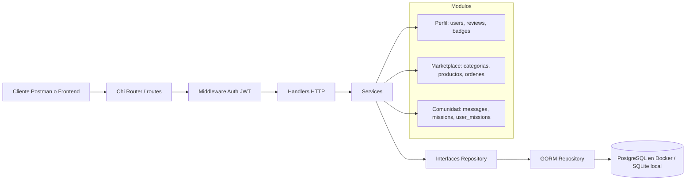

# Diagrama de arquitectura

## Flujo de una request

1. El cliente envia una peticion a `/api/v1`.
2. `routes` registra la ruta y aplica middleware si corresponde.
3. `middleware.Auth` valida `Authorization: Bearer <token>` y guarda `usuarioID` y `rol` en el contexto.
4. El handler decodifica JSON, lee parametros y llama al service.
5. El service valida reglas de negocio y usa la interfaz del repository.
6. El repository usa GORM para consultar o guardar en la base.
7. El handler responde JSON con codigo HTTP adecuado.

## Inyeccion de dependencias

`cmd/marketplace-api/main.go` crea la conexion GORM, ejecuta `AutoMigrate`, instancia repositorios, construye servicios y finalmente arma `handlers.Server`. Asi las capas no se crean entre si: se reciben por constructor.
