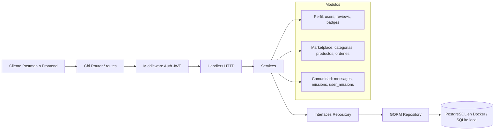

# Diagrama de arquitectura

## Flujo de una request

1. El cliente envia una peticion a `/api/v1`.
2. `routes` registra la ruta y aplica middleware si corresponde.
3. `middleware.Auth` valida `Authorization: Bearer <token>` y guarda `usuarioID` y `rol` en el contexto.
4. El handler decodifica JSON, lee parametros y llama al service.
5. El service valida reglas de negocio y usa la interfaz del repository.
6. El repository usa GORM para consultar o guardar en la base.
7. El handler responde JSON con codigo HTTP adecuado.

## Inyeccion de dependencias

`cmd/marketplace-api/main.go` crea la conexion GORM, ejecuta `AutoMigrate`, instancia repositorios, construye servicios y finalmente arma `handlers.Server`. Asi las capas no se crean entre si: se reciben por constructor.

## Estructura del proyecto

textmarketplace-uleam/
├── cmd/
│   └── marketplace-api/
│       └── main.go              # Punto de entrada de la API
├── db/
│   ├── queries.sql               # Consultas usadas por sqlc
│   └── schema.sql                # Esquema de la base de datos
├── docs/
│   ├── arquitectura.md
│   └── cierre.md
├── internal/
│   ├── config/
│   │   └── config.go              # Carga de variables de entorno
│   ├── handlers/                  # Capa HTTP (handlers delgados)
│   │   ├── auth.go
│   │   ├── comunity.go
│   │   ├── ordenes.go
│   │   ├── perfil.go
│   │   ├── respond.go
│   │   ├── server.go
│   │   ├── user.go
│   │   └── *_test.go
│   ├── middleware/
│   │   ├── auth.go                # Validacion de JWT y roles
│   │   └── cors.go
│   ├── models/                    # Entidades del dominio
│   │   ├── comunities.go
│   │   ├── ordenes.go
│   │   ├── perfil.go
│   │   └── usuario.go
│   ├── routes/                    # Registro de rutas por modulo
│   │   ├── auth.go
│   │   ├── comunidad.go
│   │   ├── marketplace.go
│   │   └── perfil.go
│   ├── service/                   # Reglas de negocio
│   │   ├── auth.go
│   │   ├── comunidad.go
│   │   ├── errores.go
│   │   ├── ordenes.go
│   │   ├── perfil.go
│   │   └── *_test.go / *_mock_test.go
│   └── storage/                   # Repositorios y persistencia
│       ├── almacen.go
│       ├── comunidad.go
│       ├── marketplace.go
│       ├── memoria.go             # Implementacion en memoria (tests)
│       ├── perfil.go
│       ├── sqlc.go
│       ├── sqlcdb/                # Codigo generado por sqlc
│       │   ├── db.go
│       │   ├── models.go
│       │   └── queries.sql.go
│       ├── sqlite.go
│       ├── usuario.go
│       └── *_test.go
├── postman/
│   └── marketplace-uleam.postman_collection.json
├── docker-compose.yml
├── Dockerfile
├── Makefile
├── go.mod / go.sum
├── sqlc.yml
└── README.md